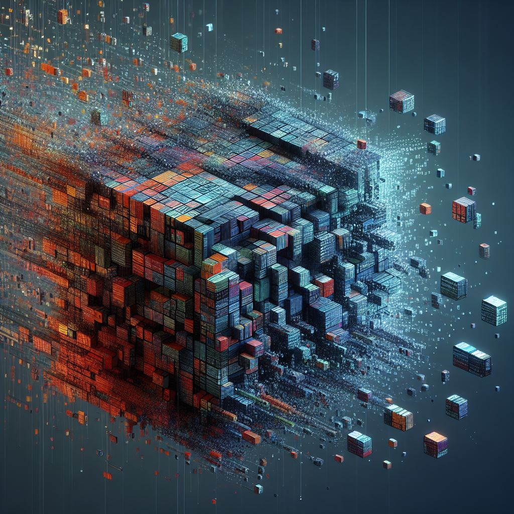
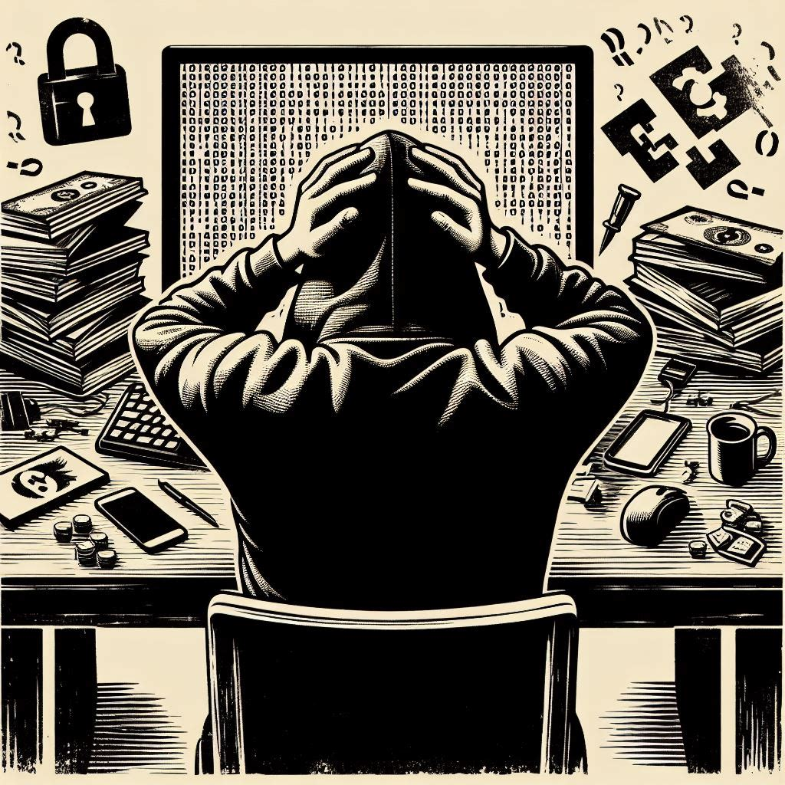

  

## Operation Cronos

A lot's already been said about Operation Cronos and their actions taken against LockBit. SANS even jumped on pretty quick to [talk about the disruption](https://www.youtube.com/watch?v=Ith3IgY8on8) and review the details posted by the Cronos Task Force shortly after the takedown went into full effect. 

I want to talk about what happens next. What should we expect to see from LockBitSupp as he tried to recoup his significant losses ($100 Million+, ouch!)? Most importantly, how are other groups going to change or spawn as the debris settles? 

    

## First, Let's Discuss the Future of LockBit. 
As a Ransomware-as-a-Service group, affiliates put a lot of trust in LockBit that their information would be kept anonymous. Most of them likely expected that their information wouldn't be maintained any more than is necessary to keep them set up as affiliates. Operation Cronos made clear that a good deal of information is stored by RaaS operators, hopefully leading to further arrests against these affiliates. This has the potential to severely hamstring LockBit's ability to recruit future affiliates.

LockBitSupp has already brought site backups back online, with multiple new victims listed. This definitely suggests some effort to either restore his image or recoup some of his lost funds from the seizures. More concerning is the lack of rules applied against affiliates now, allowing for targeting of critical infrastructure, hospitals, and government entities.

## How Traditional RaaS Might Change
The real danger is in the level of OpSec future groups gain from watching Operation Cronos take place. We saw that LockBit maintained copious records about affiliate performance. Other RaaS groups may decide to anonymous or delete this data entirely. LockBitSupp staged his Bitcoin wallets in ways that made them accessible to law enforcement after taking control of his infrastructure. Other groups are more likely to direct their funds to cold storage or offsite addresses to disconnect them from their RaaS infrastructure as much as possible. Without a doubt, other groups are definitely going to ensure they have solid backups, so they can easily recreate their infrastructure in case they're ever hit by a Cronos-level takedown.

    

## What Will "Non-Traditional" RaaS Look Like?
One potential change I've been mulling over for a while now involves the fact that RaaS groups operate the infrastructure for coordinating negotiations and payment, providing the "negotiation room" for affiliates and victims to interact. While the centralized site and list of past victims adds validity to their operations, this infrastructure puts these groups at a higher risk of capture. I predict that we may see a new form of RaaS operators who focus on creating single-use encryption/decryption executable pairs, intended for single engagements. Through this "license model," an affiliate buys the single-use package, encrypts the victim's network, exfiltrates data, etc. Future implementations of the tool may even come with a single-use VM designed to manage the victim chat over Tor. 

## Why Might This Model Make Sense?
It protects the RaaS operator in that they are not directly connected to the criminal activity. Technically, an argument could be made that they did nothing illegal, although there's little chance that the argument would hold in court. With the VMs and their management of the encryption software, they can leave a trace indicating the name of the encryption software, which could help add validity to the affiliates' claims that the decryptor they provide upon payment will work on the data they've encrypted. The only unknown becomes whether you can trust the affiliate. This is where the RaaS operator adds additional protections and value against bad affiliates by offering a submission page for victims to claim they were cheated, where they can provide the code/marker left behind by their encryption software and proof that the affiliate didn't hold up their end of the bargain. RaaS operators could ban the affiliate, provide a decryption key to the victim, or maybe develop some additional processes to handle situations like these in order to further establish themselves as a valid Ransomware organization.

There are real issues with all of these possibilities, to be sure. For example, maintaining any records of which affiliates purchase which encryption/decryption pairs poses a risk if their infrastructure is ever infiltrated, like with LockBit. A more careful group might allow anyone, including law enforcement and ransomware researchers to buy an encryption/decryption pair, trusting that their software is strong enough to avoid reverse engineering efforts or other circumvention techniques. This protects them from having to interact with affiliates. They may also decide to piecemeal their offerings, demanding extra payments for ESXi or other non-Windows systems encryptors. 

## We Have to Plan Accordingly
I'm not posting these thoughts to help button up Ransomware operations; I want us to be prepared and to think about these things with the mindset of a financially-motivated cyber criminal. I don't know what the best path forward would be if my "licensing model" takes off among Ransomware groups. One reason we might not see this come to fruition is if affiliates aren't willing to pay so much up front for the encryptor/decryptor pair, for example. But it's important to think about how the landscape might shift and start to develop plans for if and when that happens. As researchers, we're in the comfortable position of making educated guesses and seeing what happens from there. No matter how Ransomware changes, the usual recommendations always apply: know what data is most important, both in terms of exposure to the public or malicious actors and lack of access; have reliable and regular backups; have a response and disaster recovery plan. 

## Thoughts and Ideas Welcome
I'd love to continue discussion on this topic. Please reach out on X!
